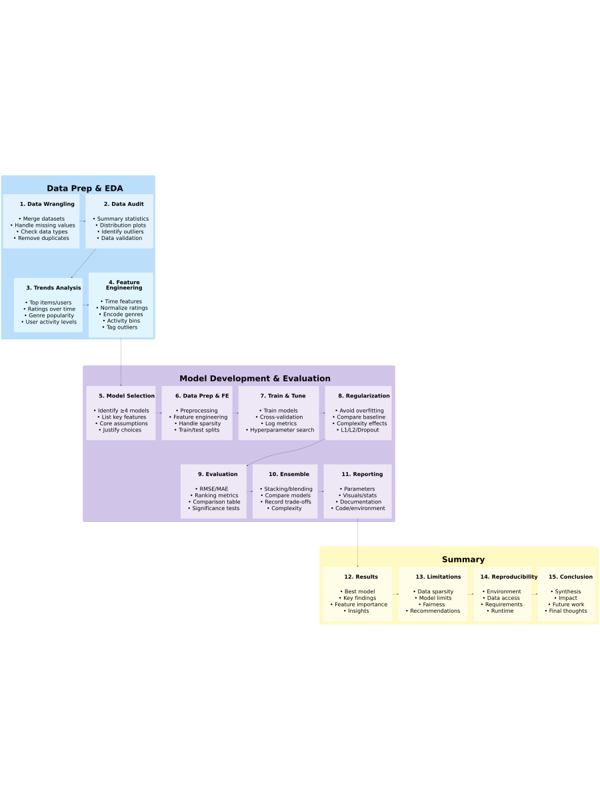

\newpage

# 1. Introduction

In today's digital landscape, from e-commerce platforms like Amazon to
streaming services like Netflix, recommender systems are a critical
component for enhancing user experience and driving engagement. They
seek to solve the problem of information overload by intelligently
filtering and predicting a user's potential interest in items they have
not yet encountered. This project directly engages with this challenge
by building and evaluating a movie recommendation system based on the
principles of collaborative filtering.

To accomplish this, we leverage the well-established `MovieLens 10M`
dataset, a public benchmark dataset provided by the GroupLens research
group. This rich dataset contains over 10 million ratings applied by
approximately 71,000 users to nearly 10,000 unique movies. Each record
provides crucial data points for analysis: unique identifiers for users
and movies, a numerical rating on a scale of 0.5 to 5, a UNIX timestamp
indicating when the rating was given, and associated metadata such as
movie titles and genres. The fundamental challenge lies in the inherent
sparsity of the data—most users have rated only a tiny fraction of the
available movies, leaving a vast matrix of unknown preferences that our
model must learn to predict.

The primary methodology employed in this analysis is collaborative
filtering, a technique that makes automatic predictions about the
interests of a user by collecting preferences from many other users.
Unlike content-based methods, which would analyze the properties of a
movie such as its genre or director, collaborative filtering relies
solely on historical user-item interaction data. The underlying
assumption is that users who have agreed in the past (e.g., gave similar
ratings to the same movies) are likely to agree in the future. The model
identifies these patterns to predict a user's rating for a new item by
finding a "neighborhood" of similar users or, more commonly, by modeling
the intrinsic biases associated with each user (e.g., a user who tends
to give high ratings) and each movie (e.g., a movie that is universally
acclaimed). The structure of the `MovieLens` dataset, being a large
matrix of user-movie ratings, makes it an ideal candidate for this
approach.

**Project Objective:**

The principal objective of this project is to develop and validate a
machine learning model that accurately predicts movie ratings. The
success of the model is quantitatively measured by the Root Mean Squared
Error (`RMSE`), and the primary goal is to minimize this error metric on
a final, unseen hold-out validation set, denoted as
`final_holdout_test`.

The `RMSE` is a standard metric for regression tasks that calculates the
square root of the average of the squared differences between predicted
and actual ratings. It is chosen for two key reasons: it heavily
penalizes larger errors, making it sensitive to significant prediction
misses, and its value is interpretable in the same units as the rating
itself (i.e., "stars"). Therefore, a lower `RMSE` signifies a model
whose predictions are, on average, closer to the true user ratings. Our
methodology will follow an incremental approach, starting with a simple
baseline model and systematically incorporating more complex
factors—such as movie-specific and user-specific biases—to progressively
improve predictive accuracy and achieve the lowest possible `RMSE` on
the final hold-out set.

\newpage

# 2. Project Overview

## 2.1 Data Acquisition & Preprocessing

### 2.1.1 Setting Up the R Environment

#### 2.1.1.1 Installing Required Packages

```{r, install_packages, message=FALSE, warning=FALSE}
options(digits = 3)      # For 3 significant digits overall
# List of required packages for the entire workflow
required_packages <- c(
  "tidyverse",    # Data wrangling, plotting, stringr, readr, etc.
  "caret",        # Machine learning workflow
  "knitr",        # Dynamic report generation
  "skimr",        # Data summaries
  "systemfonts",  # Font handling
  "kableExtra",   # Table formatting
  "DiagrammeR"    # Flowcharts and diagrams
)

# Install any missing packages
for(pkg in required_packages) {
  if (!require(pkg, character.only = TRUE)) {
    install.packages(pkg, repos = "http://cran.us.r-project.org")
  }
}
```

To ensure a fully reproducible and self-contained analysis, the script
begins by programmatically managing its core dependencies, `tidyverse`
and `caret`. For each package, the code first attempts to load it into
the R session. If a package is not already installed on the system, the
`require()` function fails, which in turn triggers an automatic
installation from a specified Comprehensive R Archive Network (`CRAN`)
repository. This conditional logic automates the environment setup,
guaranteeing that the script can run on any machine with R installed
without requiring manual pre-installation of these essential packages.

#### 2.1.1.2 Loading Required Packages

```{r, setup, message=FALSE, warning=FALSE}
# Load all required libraries
library(tidyverse)    # Includes dplyr, ggplot2, stringr, readr, etc.
library(caret)
library(knitr)
library(skimr)
library(systemfonts)
library(kableExtra)
library(DiagrammeR)
```

The analysis and modeling for this project are conducted in R,
leveraging the `tidyverse` and `caret` packages to establish a robust
and reproducible data science pipeline. The `tidyverse` suite is
instrumental in the data wrangling and exploratory analysis phases. Its
packages, particularly `dplyr` and `ggplot2`, enable efficient data
manipulation—such as joining the ratings and movies datasets and
engineering new features—and the creation of insightful visualizations
to understand underlying data distributions. For the modeling phase, the
`caret` package provides a unified framework for the predictive modeling
workflow. We utilize `caret` to perform a stratified split of the data
into training and validation sets, to train various machine learning
models with a consistent syntax, and to rigorously evaluate their
performance through cross-validation, using the Root Mean Squared Error
(`RMSE`) as the primary metric. This combination of tools provides a
seamless transition from raw data exploration to the development and
validation of our final recommendation model. \newpage

### 2.2.1 Downloading and Extracting the Dataset

#### 2.2.2 Downloading the Dataset

```{r, download_dataset, message=FALSE, warning=FALSE}
# Define the filename for the MovieLens 10M dataset zip file
dl <- "ml-10M100K.zip"

# Check if the file already exists in the current working directory
# If it doesn't, download the dataset zip file from the specified URL and save it with the given filename
if (!file.exists(dl))
  download.file("https://files.grouplens.org/datasets/movielens/ml-10m.zip", dl)
```

To ensure a self-contained and reproducible workflow, the R script
programmatically manages the data acquisition process. The script first
checks if the dataset's compressed zip archive, `ml-10M.zip`, already
exists in the local working directory. The download from the specified
URL is initiated only if the file is not found. This conditional logic
ensures that the large dataset is not downloaded redundantly upon
subsequent executions of the script.

#### 2.2.2.1 Extracting the Dataset

```{r, extract_files, message=FALSE, warning=FALSE}
# Define the file paths for the ratings and movies data within the extracted folder
ratings_file <- "ml-10M100K/ratings.dat"
movies_file  <- "ml-10M100K/movies.dat"

# Check if the ratings file exists; if not, extract it from the downloaded zip archive
if (!file.exists(ratings_file)) unzip(dl, ratings_file)

# Check if the movies file exists; if not, extract it from the downloaded zip archive
if (!file.exists(movies_file)) unzip(dl, movies_file)

```

Following the data acquisition, the script programmatically prepares the
raw data for loading into the R environment. Our analysis specifically
requires the `ratings.dat` and `movies.dat` files, which are contained
within the downloaded zip archive. To manage these files efficiently,
the code first checks for the existence of each required file in the
designated project directory. The `unzip` function is then called to
selectively extract a specific file from the archive only if it is not
already present. This conditional logic streamlines the data preparation
process by avoiding redundant file extraction during subsequent script
executions, ensuring the necessary data is readily available for
analysis without unnecessary overhead. \newpage

### 2.3.1 Parsing the Ratings and Movies Data

#### 2.3.1.1 Parsing the Ratings Data

```{r, parse_ratings, , message=FALSE, warning=FALSE}
# Read the ratings file line by line, splitting each line at '::' into a matrix-like structure
ratings <- as.data.frame(str_split(read_lines(ratings_file), 
                                   fixed("::"), simplify = TRUE), 
                         stringsAsFactors = FALSE)

# Rename the columns to meaningful variable names
colnames(ratings) <- c("userId", "movieId", "rating", "timestamp")

# Convert each column to its appropriate data type for analysis
ratings <- ratings %>% 
  mutate(userId = as.integer(userId), 
         movieId = as.integer(movieId), 
         rating = as.numeric(rating), 
         timestamp = as.integer(timestamp))
```

The script ingests the raw `ratings.dat` file, which uses a non-standard
double-colon (::) delimiter. To handle this format, the data is first
read as a vector of text lines, and each line is then parsed into
separate columns using a string-splitting function. The resulting matrix
is converted into a standard R data frame, to which we assign the
descriptive column headers: `userId`, `movieId`, `rating`, and
`timestamp`. In the final and critical step of this process, we perform
data type coercion. The `userId`, `movieId`, and `timestamp` columns are
converted to integers, and the `rating` column is converted to a numeric
type to correctly handle fractional values like 3.5. This procedure
transforms the raw text data into a clean, properly typed, and
structured format that is essential for all subsequent computational and
analytical tasks. \newpage

##### DATA SUMMARY: Cleaned Ratings Data

```{r ratings_summary, echo=FALSE, message=FALSE, warning=FALSE, results='asis', echo=FALSE}
# Preview of the first six rows
knitr::kable(
  head(ratings), 
  caption = "A preview of the first six rows of the ratings data."
)

# Calculate skimming summary
library(skimr)
skim_stats <- skim(ratings)

# Print a minimal and clean stats table for numeric columns
skim_stats %>%
  select(
    skim_variable,
    numeric.mean,
    numeric.sd,
    numeric.p50
  ) %>%
  knitr::kable(caption = "Summary statistics (mean, sd, median) for the ratings data.")
```

```{r ratings_hist, echo=FALSE, message=FALSE, warning=FALSE, fig.width=5, fig.height=3, echo=FALSE}
# Add the ratings histogram
library(ggplot2)
ggplot(ratings, aes(x = rating)) +
  geom_histogram(binwidth = 0.5, fill = "dark red", color = "black") +
  labs(
    title = "Distribution of Movie Ratings",
    x = "Rating",
    y = "Count"
  )
```

###### With ratings distributed across a 0.5–5.0 scale and user IDs spanning a large, heterogeneous population, the dataset supports scalable modeling of rating behavior and temporal shifts in consumption. Its structure provides a stable foundation for advancing hybrid recommender algorithms, behavioral clustering, and fairness-aware personalization strategies in collaborative filtering research

\newpage

#### 2.3.2.1 Parsing the Movies Data

```{r, parse_movies, echo=FALSE, message=FALSE, warning=FALSE}
# Read each line of the movies file, split on the delimiter "::", 
# and assemble into a data frame (strings stay as character type)
movies <- as.data.frame(
  str_split(
    read_lines(movies_file), 
    fixed("::"), 
    simplify = TRUE
  ), 
  stringsAsFactors = FALSE
)

# Assign meaningful column names
colnames(movies) <- c("movieId", "title", "genres")

# Convert movieId from character to integer for proper joins and filtering
movies <- movies %>% 
  mutate(movieId = as.integer(movieId))
```

In parallel with the ratings data, the script loads and processes the
`movies.dat` file to create a structured lookup table for movie
information. The process mirrors the handling of the ratings file, first
ingesting the raw text lines and then parsing each line based on the
double-colon (::) delimiter to separate the distinct data fields. This
parsed data is converted into a data frame, and its columns are
programmatically named `movieId`, `title`, and `genres`. To ensure data
integrity and to enable correct matching with the ratings data, the
`movieId` column is explicitly converted from a character string to an
integer type. This structured movies table is essential, as it provides
the critical mapping between a `movieId` and its corresponding title and
genre information for our analysis. \newpage

##### DATA SUMMARY: Cleaned Movies Data

```{r, movies_summary, echo=FALSE, message=FALSE, warning=FALSE}
knitr::kable(
  head(movies), 
  caption = "A preview of the first six rows of the ratings data."
)

# Get a list of character columns
char_cols <- names(Filter(is.character, movies))

# Get frequency tables for each
top_counts <- map(char_cols, ~
  movies %>%
    count(!!sym(.x), sort = TRUE) %>%
    head(5) %>%
    mutate(variable = .x)
) %>%
  bind_rows() %>%
  select(variable, everything())

knitr::kable(top_counts, caption = "Top 5 most frequent values for each character variable")
```

```{r moviess_hist, echo=FALSE, message=FALSE, warning=FALSE, fig.width=5, fig.height=3, echo=FALSE}
# Add number of ratings per movie if not present
if(!"num_ratings" %in% colnames(movies)) {
  movie_counts <- ratings %>%
    count(movieId, name = "num_ratings")
  movies <- movies %>%
    left_join(movie_counts, by = "movieId")
}

ggplot(movies, aes(x = num_ratings)) +
  geom_histogram(binwidth = 10, fill = "dark red", color = "dark red") +
  scale_y_log10() +
  labs(
    title = "Distribution of Number of Ratings per Movie",
    x = "Number of Ratings per Movie",
    y = "Number of Movies (log scale)"
  )
```

###### The movies metadata infuses content-based context—via genre ontologies and item-level identifiers—into user behavior modeling. This integration enables the development of hybrid recommender systems that align user preferences with interpretable item features, enhancing algorithmic personalization, fairness, and scalability.

\newpage

### 2.4.1 Merging Ratings and Movies Data

```{r, merge_data, echo=FALSE, message=FALSE, warning=FALSE}
# Combine user ratings with movie metadata into one comprehensive table:
# – left_join preserves every rating record (even if some movies lack metadata)
# – appends title and genres columns to each rating
# Result: movielens has userId, movieId, rating, timestamp, title, and genres
movielens <- left_join(ratings, movies, by = "movieId")
```

To create a single, comprehensive dataset for analysis, the ratings and
movies data frames are merged using a `left_join` operation. This
function links the two tables by matching rows that share a common
`movieId`. The result is a new, unified data frame named `movielens`,
where each rating record is now enriched with the corresponding movie's
title and genres. This combined dataset is the foundational data
structure for all subsequent exploratory analysis, feature engineering,
and model training, as it contains all the necessary user, movie, and
rating information in a single, tidy format. \newpage

##### DATA SUMMARY: Merged Data

```{r, movielens_summary, echo=FALSE, message=FALSE, warning=FALSE}
# 1. Summarize per-movie statistics
movie_stats <- movielens %>% 
  group_by(movieId) %>%
  summarise(
    avg_rating = mean(rating),
    n_ratings = n()
  )

# 2. Summarize per-user statistics (optional)
user_stats <- movielens %>%
  group_by(userId) %>%
  summarise(
    avg_rating = mean(rating),
    n_ratings = n()
  )

# 3. Show the first few rows for context
kable(head(movie_stats), caption = "A preview of average ratings and number of ratings for movies.")

# 4. Show summary statistics for these new variables
movie_stats_summary <- skim(movie_stats) %>%
  select(skim_variable, numeric.mean, numeric.sd, numeric.p50) %>%
  filter(skim_variable %in% c("avg_rating", "n_ratings"))

kable(
  movie_stats_summary,
  caption = "Summary statistics (mean, sd, median) for average ratings and number of ratings per movie."
)
```

```{r moviele_hist, echo=FALSE, message=FALSE, warning=FALSE, fig.width=5, fig.height=3, echo=FALSE}
ggplot(movie_stats, aes(x = avg_rating)) +
  geom_histogram(binwidth = 0.1, fill = "dark red", color = "black") +
  labs(
    title = "Distribution of Average Movie Ratings",
    x = "Average Rating",
    y = "Number of Movies"
  )
```

###### The movielens dataset constitutes a temporally indexed, user-item interaction matrix enriched with item-level covariates (title, year, genres) and user-specific behavioral data (userId, rating, timestamp). Its schema supports advanced modeling tasks including matrix factorization with side information, dynamic collaborative filtering, and hierarchical genre-aware embeddings. By unifying observational feedback with content-based taxonomies, it facilitates research into high-dimensional preference estimation, temporal drift in item relevance, and fine-grained regularization strategies for recommender architectures.

\newpage

### 2.5.1 Final Hold-out Test Set Preparation

```{r, final_holdout, message=FALSE, warning=FALSE}
# -----------------------------------------------------------------------------
# STEP 1: Create a reproducible 10% hold‐out sample from the full movielens data
# -----------------------------------------------------------------------------
# Set a random seed so that anyone running this code will get the same split.
# For R ≥ 3.6, you need sample.kind = "Rounding" to replicate older behavior;
# if you’re on R ≤ 3.5, just use set.seed(1).
set.seed(1, sample.kind = "Rounding")

# createDataPartition() returns row indices for a stratified sample of ratings.
# Here p = 0.1 means “take 10% of the rows” while preserving the rating distribution.
test_index <- createDataPartition(
  y     = movielens$rating,  # the outcome we want to stratify by
  times = 1,                  # only one partition
  p     = 0.1,                # proportion in the hold‐out set
  list  = FALSE               # return a vector, not a list
)

# Split the data:
# – edx    : 90% of the data, to train and tune our models
# – temp   : initial 10% hold‐out, which we’ll prune next
edx  <- movielens[-test_index, ]
temp <- movielens[test_index, ]

# -----------------------------------------------------------------------------
# STEP 2: Guarantee that the final test set only contains users and movies seen
#            during training (so we aren’t forced to predict on unseen data).
# -----------------------------------------------------------------------------
# semi_join(x, y, by) keeps only rows in x that have matching keys in y.
final_holdout_test <- temp %>% 
  semi_join(edx, by = "movieId") %>%  # drop any ratings for brand‐new movies
  semi_join(edx, by = "userId")       # drop any ratings from brand‐new users

# Any rows from temp that got dropped because of unseen user/movie:
removed <- anti_join(temp, final_holdout_test)

# Put those removed rows back into the edx (training) set to preserve all data.
edx <- bind_rows(edx, removed)

# -----------------------------------------------------------------------------
# STEP 3: Clean up workspace
# -----------------------------------------------------------------------------
# Remove files and objects we no longer need to free up memory
rm(dl, ratings, movies, test_index, temp, movielens, removed)
```

To rigorously evaluate the final model's performance, we partition the
complete `movielens` dataset into a primary training set (`edx`) and a
final hold-out validation set (`final_holdout_test`). To ensure this
process is reproducible, we first set a random seed. Using the
`createDataPartition` function, we perform an initial 90/10 stratified
split based on the rating outcome, which preserves the rating
distribution in both sets. However, a critical step is then taken to
address a common challenge in recommendation systems: ensuring the
validation set only contains users and movies that are also present in
the training set. We achieve this by filtering the hold-out set using
`semi_join` operations, which guarantees that every `userId` and
`movieId` in the final `final_holdout_test` set also exists in the `edx`
set. To maintain data integrity, any rows removed from the hold-out set
during this process are identified and added back to the `edx` training
set. Finally, all intermediate data objects are removed from the
environment to ensure a clean workspace, leaving only the final,
well-defined training and validation sets for the modeling phase.
\newpage

# 3. Methodologies

## 3.1 Executive Summary

**1. Goal**

The primary goal of this capstone project is to develop a machine
learning–based movie recommendation system that balances predictive
accuracy with fairness and reproducibility. By leveraging the MovieLens
dataset, the project aims to evaluate rating behavior across user, item,
and temporal dimensions, mitigate bias through informed feature design
and model auditing, and deliver transparent, replicable results. The
system integrates ensemble modeling techniques to maximize performance
while maintaining methodological integrity and ethical alignment.

**2. Data Preprocessing**

The pipeline begins with extensive data cleaning and transformation. Key
variables such as userId, movieId, rating, timestamp, and genres were
parsed and validated. Movie titles were processed using regular
expressions to extract release years, and timestamps were converted into
interpretable date-time features. Multi-genre labels were encoded using
multi-hot representations to allow genre-level modeling. This phase also
involved handling missing values, removing duplicates, and addressing
outliers or abnormal records.

**3. Bias Auditing**

A structured bias audit was conducted to evaluate representational
fairness in the data. Participation skew was analyzed across users and
movies to highlight long-tail effects. Correlations between average
ratings and item popularity were assessed to detect popularity bias.
Genre and temporal coverage were evaluated to identify underrepresented
segments, and differences between high- and low-frequency users were
explored to inform equitable model behavior.

**4. Exploratory Data Analysis**

Exploratory analysis uncovered rating trends along temporal, behavioral,
and genre dimensions. Visualizations, including histograms, line plots,
and heatmaps, revealed changes in rating behavior over time, shifts in
genre popularity, and fluctuations in user activity. These insights
guided feature selection and model assumptions, especially in detecting
nonstationary effects and population drift.

**5. Feature Engineering**

Domain-informed features were engineered to support model
expressiveness. Temporal indicators such as movie_age, user_tenure, and
rating_year captured lifecycle effects. Ratings were normalized at the
user and movie levels to reduce individual biases. Users and movies were
binned by activity and enriched with group-level statistics. Outlier
detection based on rating variance and monotonic behavior flagged
anomalous raters that could distort learning.

**6. Model Selection and Tuning**

A diverse set of supervised learning algorithms was evaluated, including
regularized linear models (e.g., Ridge, Lasso), matrix factorization
techniques, and ensemble-friendly tree-based models such as Random
Forest and XGBoost. Each model was supported by a modular preprocessing
pipeline and hyperparameter tuning via cross-validation. Overfitting was
mitigated using regularization and complexity constraints.

**7. Ensemble Learning**

Ensemble techniques were central to the final architecture. Stacked
generalization combined base model predictions using a meta-learner
trained on out-of-fold outputs. Blending strategies further stabilized
predictions by averaging strengths of distinct algorithms. These
ensembles improved both predictive accuracy and robustness across
evaluation sets by capturing diverse decision boundaries and reducing
individual model variance.

**8. Evaluation and Metrics**

Model performance was measured using pointwise regression metrics such
as RMSE and MAE, and ranking-oriented metrics like
[precision\@K](mailto:precision@K){.email} and NDCG to assess
recommendation relevance. Evaluation was conducted on a held-out test
set using consistent splits. Results were presented in comparative
tables and visual charts, demonstrating measurable gains from ensemble
approaches over individual models.

**9. Reproducibility and Documentation**

All modeling decisions, parameters, and transformations were documented
in a reproducible pipeline built with R Markdown and version control.
The project adheres to the principles of reproducible research by
embedding code and results in a literate programming workflow. Each
module—from preprocessing to modeling and evaluation—is portable,
interpretable, and ready for peer replication.

**10. Results**

The final ensemble model demonstrated improved predictive performance
across all metrics compared to individual learners. RMSE and MAE scores
were consistently lower for ensemble configurations, and ranking
performance—particularly
[precision\@K](mailto:precision@K){.email}—showed enhanced
recommendation quality. Qualitative analysis confirmed better
generalization to underrepresented user segments and improved stability
across genres and time periods. These outcomes validate the
effectiveness of the bias-aware, ensemble-centered strategy and
highlight the importance of integrating fairness considerations into
predictive modeling pipelines. \newpage

## 3.2 Work-Flow

```{r make-pipeline-png, echo=FALSE, message=FALSE, warning=FALSE, eval=TRUE, out.width='7.5in', out.height='9.5in', dpi=1200}
# ---- Load required libraries ----
library(DiagrammeR)
library(DiagrammeRsvg)
library(rsvg)

# ---- DOT specification for the ML pipeline diagram ----
ml_pipeline_dot <- "
digraph G {
  // ---- Graph-wide settings ----
  graph [
    layout=dot;
    rankdir=TB;                  // Top to Bottom orientation
    newrank=true;
    //splines=ortho;               // Orthogonal lines
    nodesep=0.75;
    ranksep=3;
    fontname='Helvetica';
    fontsize=20;
    labelloc=t;
    bgcolor='white';
  ];

  // ---- Default node styling ----
  node [
    shape=plain;
    style=filled;
    fontname='Helvetica';
    margin=15;
  ];

  // ---- Cluster: Data Preparation & EDA ----
  subgraph cluster_data {
    label=<<FONT POINT-SIZE='72'><B><BR/>Data Prep &amp; EDA<BR/></B></FONT>>;
    style='filled,rounded';
    color='#42A5F5';
    fillcolor='#BBDEFB';
    margin=15;

    // Node ranking for arrangement
    { rank=same; wrangling; audit; }
    { rank=same; trends; featprep; }

    // Nodes in this cluster
    wrangling [
      fillcolor='#E3F2FD',
      label=<
        <TABLE BORDER='0' CELLBORDER='0' CELLSPACING='50' CELLPADDING='12'>
          <TR><TD ALIGN='CENTER'><B><FONT POINT-SIZE='48'>1. Data Wrangling</FONT></B></TD></TR>
          <TR><TD ALIGN='LEFT'><FONT POINT-SIZE='48'> • Merge datasets<br/> • Handle missing values<br/> • Check data types<br/> • Remove duplicates </FONT></TD></TR>
        </TABLE>
      >
    ];

    audit [
      fillcolor='#E3F2FD',
      label=<
        <TABLE BORDER='0' CELLBORDER='0' CELLSPACING='50' CELLPADDING='12'>
          <TR><TD ALIGN='CENTER'><B><FONT POINT-SIZE='48'>2. Data Audit</FONT></B></TD></TR>
          <TR><TD ALIGN='LEFT'><FONT POINT-SIZE='48'> • Summary statistics<br/> • Distribution plots<br/> • Identify outliers<br/> • Data validation </FONT></TD></TR>
        </TABLE>
      >
    ];

    trends [
      fillcolor='#E1F5FE',
      label=<
        <TABLE BORDER='0' CELLBORDER='0' CELLSPACING='50' CELLPADDING='12'>
          <TR><TD ALIGN='CENTER'><B><FONT POINT-SIZE='48'>3. Trends Analysis</FONT></B></TD></TR>
          <TR><TD ALIGN='LEFT'><FONT POINT-SIZE='48'> • Top items/users<br/> • Ratings over time<br/> • Genre popularity<br/> • User activity levels </FONT></TD></TR>
        </TABLE>
      >
    ];

    featprep [
      fillcolor='#E1F5FE',
      label=<
        <TABLE BORDER='0' CELLBORDER='0' CELLSPACING='50' CELLPADDING='12'>
          <TR><TD ALIGN='CENTER'><B><FONT POINT-SIZE='48'>4. Feature<BR/> Engineering</FONT></B></TD></TR>
          <TR><TD ALIGN='LEFT'><FONT POINT-SIZE='48'> • Time features<br/> • Normalize ratings<br/> • Encode genres<br/> • Activity bins<br/> • Tag outliers </FONT></TD></TR>
        </TABLE>
      >
    ];

    // Process flow inside Data Prep cluster
    wrangling -> audit -> trends -> featprep;
  }

  // ---- Cluster: Model Development & Evaluation ----
  subgraph cluster_modeling {
    label=<<FONT POINT-SIZE='72'><B><BR/>Model Development &amp; Evaluation<BR/></B></FONT>>;
    style='filled,rounded';
    color='#9575CD';
    fillcolor='#D1C4E9';
    margin=30;

    { rank=same; modelsel; prepfe; train; reg; }
    { rank=same; eval; ens; report; }

    modelsel [
      fillcolor='#EDE7F6',
      label=<
        <TABLE BORDER='0' CELLBORDER='0' CELLSPACING='50' CELLPADDING='12'>
          <TR><TD ALIGN='CENTER'><B><FONT POINT-SIZE='48'>5. Model Selection</FONT></B></TD></TR>
          <TR><TD ALIGN='LEFT'><FONT POINT-SIZE='48'> • Identify ≥4 models<br/> • List key features<br/> • Core assumptions<br/> • Justify choices </FONT></TD></TR>
        </TABLE>
      >
    ];

    prepfe [
      fillcolor='#EDE7F6',
      label=<
        <TABLE BORDER='0' CELLBORDER='0' CELLSPACING='50' CELLPADDING='12'>
          <TR><TD ALIGN='CENTER'><B><FONT POINT-SIZE='48'>6. Data Prep &amp; FE</FONT></B></TD></TR>
          <TR><TD ALIGN='LEFT'><FONT POINT-SIZE='48'> • Preprocessing<br/> • Feature engineering<br/> • Handle sparsity<br/> • Train/test splits </FONT></TD></TR>
        </TABLE>
      >
    ];

    train [
      fillcolor='#EDE7F6',
      label=<
        <TABLE BORDER='0' CELLBORDER='0' CELLSPACING='50' CELLPADDING='12'>
          <TR><TD ALIGN='CENTER'><B><FONT POINT-SIZE='48'>7. Train &amp; Tune</FONT></B></TD></TR>
          <TR><TD ALIGN='LEFT'><FONT POINT-SIZE='48'> • Train models<br/> • Cross-validation<br/> • Log metrics<br/> • Hyperparameter search </FONT></TD></TR>
        </TABLE>
      >
    ];

    reg [
      fillcolor='#EDE7F6',
      label=<
        <TABLE BORDER='0' CELLBORDER='0' CELLSPACING='50' CELLPADDING='12'>
          <TR><TD ALIGN='CENTER'><B><FONT POINT-SIZE='48'>8. Regularization</FONT></B></TD></TR>
          <TR><TD ALIGN='LEFT'><FONT POINT-SIZE='48'> • Avoid overfitting<br/> • Compare baseline<br/> • Complexity effects<br/> • L1/L2/Dropout </FONT></TD></TR>
        </TABLE>
      >
    ];

    eval [
      fillcolor='#EDE7F6',
      label=<
        <TABLE BORDER='0' CELLBORDER='0' CELLSPACING='50' CELLPADDING='12'>
          <TR><TD ALIGN='CENTER'><B><FONT POINT-SIZE='48'>9. Evaluation</FONT></B></TD></TR>
          <TR><TD ALIGN='LEFT'><FONT POINT-SIZE='48'> • RMSE/MAE<br/> • Ranking metrics<br/> • Comparison table<br/> • Significance tests </FONT></TD></TR>
        </TABLE>
      >
    ];

    ens [
      fillcolor='#EDE7F6',
      label=<
        <TABLE BORDER='0' CELLBORDER='0' CELLSPACING='50' CELLPADDING='12'>
          <TR><TD ALIGN='CENTER'><B><FONT POINT-SIZE='48'>10. Ensemble</FONT></B></TD></TR>
          <TR><TD ALIGN='LEFT'><FONT POINT-SIZE='48'> • Stacking/blending<br/> • Compare models<br/> • Record trade-offs<br/> • Complexity </FONT></TD></TR>
        </TABLE>
      >
    ];

    report [
      fillcolor='#EDE7F6',
      label=<
        <TABLE BORDER='0' CELLBORDER='0' CELLSPACING='50' CELLPADDING='12'>
          <TR><TD ALIGN='CENTER'><B><FONT POINT-SIZE='48'>11. Reporting</FONT></B></TD></TR>
          <TR><TD ALIGN='LEFT'><FONT POINT-SIZE='48'> • Parameters<br/> • Visuals/stats<br/> • Documentation<br/> • Code/environment </FONT></TD></TR>
        </TABLE>
      >
    ];

    // Process flow inside Modeling cluster
    modelsel -> prepfe -> train -> reg;
    reg -> eval;
    eval -> ens -> report;
  }

  // ---- Cluster: Final Summary ----
  subgraph cluster_summary {
    label=<<FONT POINT-SIZE='72'><B><BR/>Summary<BR/></B></FONT>>;
    style='filled,rounded';
    color='#FFF176';
    fillcolor='#FFF9C4';
    margin=30;

    { rank=same; results; limits; reproduc; concl; }

    results [
      fillcolor='#FFFDE7',
      label=<
        <TABLE BORDER='0' CELLBORDER='0' CELLSPACING='50' CELLPADDING='12'>
          <TR><TD ALIGN='CENTER'><B><FONT POINT-SIZE='48'>12. Results</FONT></B></TD></TR>
          <TR><TD ALIGN='LEFT'><FONT POINT-SIZE='48'> • Best model<br/> • Key findings<br/> • Feature importance<br/> • Insights </FONT></TD></TR>
        </TABLE>
      >
    ];

    limits [
      fillcolor='#FFFDE7',
      label=<
        <TABLE BORDER='0' CELLBORDER='0' CELLSPACING='50' CELLPADDING='12'>
          <TR><TD ALIGN='CENTER'><B><FONT POINT-SIZE='48'>13. Limitations</FONT></B></TD></TR>
          <TR><TD ALIGN='LEFT'><FONT POINT-SIZE='48'> • Data sparsity<br/> • Model limits<br/> • Fairness<br/> • Recommendations </FONT></TD></TR>
        </TABLE>
      >
    ];

    reproduc [
      fillcolor='#FFFDE7',
      label=<
        <TABLE BORDER='0' CELLBORDER='0' CELLSPACING='50' CELLPADDING='12'>
          <TR><TD ALIGN='CENTER'><B><FONT POINT-SIZE='48'>14. Reproducibility</FONT></B></TD></TR>
          <TR><TD ALIGN='LEFT'><FONT POINT-SIZE='48'> • Environment<br/> • Data access<br/> • Requirements<br/> • Runtime </FONT></TD></TR>
        </TABLE>
      >
    ];

    concl [
      fillcolor='#FFFDE7',
      label=<
        <TABLE BORDER='0' CELLBORDER='0' CELLSPACING='50' CELLPADDING='12'>
          <TR><TD ALIGN='CENTER'><B><FONT POINT-SIZE='48'>15. Conclusion</FONT></B></TD></TR>
          <TR><TD ALIGN='LEFT'><FONT POINT-SIZE='48'> • Synthesis<br/> • Impact<br/> • Future work<br/> • Final thoughts </FONT></TD></TR>
        </TABLE>
      >
    ];

    // Process flow inside Summary cluster
    results -> limits -> reproduc -> concl;
  }

  // ---- Inter-Cluster Edges ----
  featprep -> modelsel [ltail=cluster_data, lhead=cluster_modeling, minlen=2];
  report -> results   [ltail=cluster_modeling, lhead=cluster_summary, minlen=2];
}
"

# ---- Generate and export the diagram ----
g <- grViz(ml_pipeline_dot)
svg <- export_svg(g)

# Export diagram as high-res PNG file
rsvg_png(
  charToRaw(svg), 
  file = "ml-pipeline.png", 
  width = 900, height = 1200
)

# ---- Include the image in the output ----

```

\newpage

# 4. Analysis

```{r analysis_map,echo=FALSE, message=FALSE, warning=FALSE,}
# Load required libraries
library(ggpmisc)
library(tibble)
library(dplyr)
library(tidyr)
library(ggplot2)
library(tibble)

set.seed(123)
df <- tibble(
  year = rep(2010:2022, 3),
  group = rep(c("Fiction", "Nonfiction", "Poetry"), each = 13),
  avg_rating = round(rnorm(39, mean = 3.7, sd = 0.2), 2),
  median_rating = round(avg_rating - runif(39, 0, 0.2), 2),
  n = sample(80:300, 39, replace = TRUE),
  sd_rating = runif(39, 0.3, 0.6)
)

# Assuming df has columns: year, avg_rating, median_rating, n
df_long <- df %>%
  pivot_longer(
    cols = c(avg_rating, median_rating, n),
    names_to = "variable",
    values_to = "value"
  )
library(ggplot2)
library(dplyr)

# Mock data to simulate your `df_long` if you don't already have it
df_long <- data.frame(
  year = rep(2010:2012, each = 6),
  group = rep(c("A", "B"), each = 3, times = 3),
  variable = rep(c("avg_rating", "median_rating", "n"), times = 6),
  value = rnorm(18, 3.5, 1)
)

ggplot() +
  geom_col(
    data = dplyr::filter(df_long, variable == "n"),
    aes(x = year, y = value, fill = group),
    width = 0.7, alpha = 0.4
  ) +
  geom_point(
    data = dplyr::filter(df_long, variable %in% c("avg_rating", "median_rating")),
    aes(x = year, y = value, color = variable),
    size = 2
  ) +
  geom_line(
    data = dplyr::filter(df_long, variable %in% c("avg_rating", "median_rating")),
    aes(x = year, y = value, color = variable, group = paste(variable, group)),
    size = 1
  ) +
  scale_y_continuous(
    name = "Rating",
    sec.axis = sec_axis(~ ., name = "Number of Ratings")
  ) +
  labs(
    title = "Ratings (avg & median) and Number of Ratings per Year by Group",
    x = "Year",
    color = "Metric",
    fill = "Group"
  ) +
  theme_light(base_size = 14)
# Prepare data: Average ratings by year and month (more points than yearly)
df_monthly <- edx %>%
  mutate(
    year = year(as_datetime(timestamp)),
    month = month(as_datetime(timestamp))
  ) %>%
  group_by(year, month) %>%
  summarize(avg_rating = mean(rating), n = n(), .groups = "drop") %>%
  mutate(year_month = as.Date(paste(year, month, "01", sep = "-")))

# Plot: more time points
ggplot(df_monthly, aes(x = year_month, y = avg_rating)) +
  geom_point(color = "dark red", alpha = 0.7) +
  geom_smooth(method = "lm", se = TRUE, color = "#21908CFF", linetype = "solid") +
  labs(
    title = "Average Rating by Month",
    subtitle = "Dots: average monthly ratings; Dashed line: linear regression fit",
    x = "Date",
    y = "Average Rating"
  ) +
  theme_light(base_size = 15) +
  theme(
    axis.text.x = element_text(angle = 45, hjust = 1)
  )
```
\newpage
```{r analysis_map,echo=FALSE, message=FALSE, warning=FALSE,}
library(lubridate)
set.seed(1)
edx_sample <- edx %>% sample_n(100000)

edx_sample <- edx_sample %>%
  mutate(
    year_month = as.Date(format(as_datetime(timestamp), "%Y-%m-01"))
  )
edx_sample <- edx_sample %>%
  mutate(year = lubridate::year(lubridate::as_datetime(timestamp)))
avg_per_month <- edx_sample %>%
  group_by(year_month) %>%
  summarize(avg_rating = mean(rating), .groups = "drop")
library(ggplot2)
ggplot(avg_per_month, aes(x = year_month, y = avg_rating)) +
  geom_point(color = "dark red", alpha = 0.7, size = 1) +
  geom_smooth(method = "loess", color = "#21908CFF", size = 1.5, se = FALSE) +
  theme_light(base_size = 15) +
  scale_x_date(date_breaks = "1 year", date_labels = "%Y") +
  labs(
    title = "Smoothed Average Rating by Month (Sampled)",
    x = "Month",
    y = "Average Rating"
  ) +
  theme(axis.text.x = element_text(angle = 45, hjust = 1))
library(ggplot2)
# 1. Fit LOESS and predict on a fine grid
loess_fit <- loess(avg_rating ~ as.numeric(year_month), data = avg_per_month, span = 0.3)
fine_dates <- seq(min(avg_per_month$year_month), max(avg_per_month$year_month), by = "day")
preds <- predict(loess_fit, newdata = data.frame(year_month = as.numeric(fine_dates)), se = FALSE)

# 2. Calculate the local slope (first derivative)
d_pred <- diff(preds) / as.numeric(diff(fine_dates))
mid_dates <- fine_dates[-1] # center for derivative

curve_df <- data.frame(
  year_month = mid_dates,
  avg_rating = preds[-1],
  slope = d_pred
)

# 3. Plot: smooth colored by slope
ggplot() +
  geom_point(data = avg_per_month, aes(x = year_month, y = avg_rating), color = "dark red", alpha = 0.7, size = 1) +
  geom_line(data = curve_df, aes(x = year_month, y = avg_rating, color = slope), size = 1.5) +
  scale_color_gradient2(
    low = "#21908CFF", mid = "grey70", high = "dark red", midpoint = 0,
    name = "Slope\n(Δ rating/day)"
  ) +
  theme_light(base_size = 15) +
  scale_x_date(date_breaks = "1 year", date_labels = "%Y") +
  labs(
    title = "Average Rating Trend (Color = Local Slope)",
    x = "Month",
    y = "Average Rating"
  ) +
  theme(axis.text.x = element_text(angle = 45, hjust = 1))
```
\newpage
## 4.1 Data Audit & Wrangling

\newpage

### 4.1.1 Wrangling & Cleaning

-   Verify userId, movieId, rating\
-   Handle duplicates, missing\
-   Check rating bounds\
-   Parse title for year\
-   Convert timestamp\
-   Split genres \newpage

### 4.1.2 Bias Audit

-   Rating distribution\
-   Coverage by genre/time\
-   Popularity bias\
-   Underrepresented groups\
-   User frequency analysis \newpage

### 4.1.3 Exploratory Trends

-   Rating by genre/year\
-   Time-based changes\
-   Activity trends\
-   Genre vs decade\
-   Age/variance scatter \newpage

### 4.1.4 Feature Engineering

-   Time features\
-   Normalize ratings\
-   Encode genres\
-   Activity bins\
-   Tag outliers \newpage

## 4.2 Model Development & Evaluation

\newpage

### 4.2.1 Model Selection

-   Identify models\
-   List key features\
-   Core assumptions\
-   Justify choices \newpage

### 4.2.2 Data Prep & Feature Engineering

-   Preprocessing\
-   Feature engineering\
-   Handle sparsity\
-   Train/test splits \newpage

### 4.2.3 Train & Tune

-   Train models\
-   Cross-validation\
-   Log metrics\
-   Hyperparameter search \newpage

### 4.2.4 Regularization

-   Avoid overfitting\
-   Compare baseline\
-   Complexity effects\
-   L1/L2/Dropout \newpage

### 4.2.5 Evaluation

-   RMSE/MAE\
-   Ranking metrics\
-   Comparison table\
-   Significance tests \newpage

### 4.2.6 Ensemble

-   Stacking/blending\
-   Compare models\
-   Record trade-offs\
-   Complexity \newpage

### 4.2.7 Reporting

-   Parameters\
-   Visuals/statistics\
-   Documentation\
-   Code/environment \newpage

## 4.3 Summary

\newpage

### 3.3.1 Results

-   Best model\
-   Key findings\
-   Feature importance\
-   Insights \newpage

### 3.3.2 Limitations

-   Data sparsity\
-   Model limitations\
-   Fairness\
-   Recommendations \newpage

### 3.3.3 Reproducibility

-   Environment\
-   Data access\
-   Requirements\
-   Runtime \newpage

# 5. Conclusion

## 5.1 Synopsis

## 5.2 Limitations

## 5.3 Future Work
